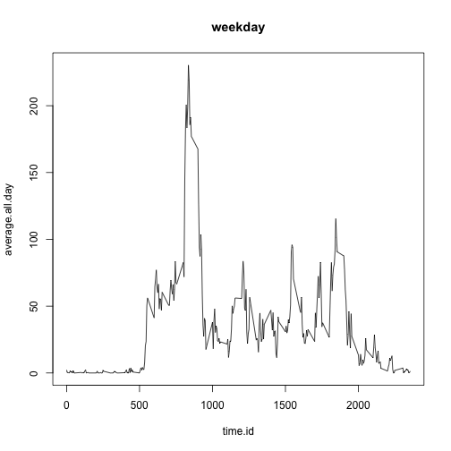

This is an R Markdown document for the assignment of Data Scientis Coursera Course; Reproducible Research. 

# Loarding and Processing the data

Read CSV (activity.csv) file.


```r
activity <- read.csv("/Users/okyunoh/Desktop/activity.csv", header = TRUE)
head(activity);str(activity); dim(activity)
```

```
##   steps       date interval
## 1    NA 2012-10-01        0
## 2    NA 2012-10-01        5
## 3    NA 2012-10-01       10
## 4    NA 2012-10-01       15
## 5    NA 2012-10-01       20
## 6    NA 2012-10-01       25
```

```
## 'data.frame':	17568 obs. of  3 variables:
##  $ steps   : int  NA NA NA NA NA NA NA NA NA NA ...
##  $ date    : Factor w/ 61 levels "2012-10-01","2012-10-02",..: 1 1 1 1 1 1 1 1 1 1 ...
##  $ interval: int  0 5 10 15 20 25 30 35 40 45 ...
```

```
## [1] 17568     3
```

```r
activity[,2] <- as.Date(as.character(activity[,2]), "%Y-%m-%d")
head(activity);str(activity); dim(activity)
```

```
##   steps       date interval
## 1    NA 2012-10-01        0
## 2    NA 2012-10-01        5
## 3    NA 2012-10-01       10
## 4    NA 2012-10-01       15
## 5    NA 2012-10-01       20
## 6    NA 2012-10-01       25
```

```
## 'data.frame':	17568 obs. of  3 variables:
##  $ steps   : int  NA NA NA NA NA NA NA NA NA NA ...
##  $ date    : Date, format: "2012-10-01" "2012-10-01" ...
##  $ interval: int  0 5 10 15 20 25 30 35 40 45 ...
```

```
## [1] 17568     3
```


# What is mean total number of steps taken per day?

calculation of total number of steps on each day.


```r
dates <- unique(activity[,2])
total.steps <- vector ()
for (i in 1:length(dates)){
        df.of.the.day <- activity[activity$date == dates[i],]
        total.steps.of.the.day <- sum(df.of.the.day[,1])
        total.steps <- c(total.steps, total.steps.of.the.day)
}
total.steps.each.day <- data.frame(date = dates, steps = total.steps)
head(total.steps.each.day)
```

```
##         date steps
## 1 2012-10-01    NA
## 2 2012-10-02   126
## 3 2012-10-03 11352
## 4 2012-10-04 12116
## 5 2012-10-05 13294
## 6 2012-10-06 15420
```

* histogram of the total number of steps taken each day


```r
hist(total.steps.each.day$steps)
```

 

* mean and median of the total number of steps taken per day


```r
mean(total.steps.each.day$steps, na.rm = TRUE); median(total.steps.each.day$steps, na.rm = TRUE)
```

```
## [1] 10766.19
```

```
## [1] 10765
```

# What is the average daily activity pattern?

* Make a time series plot (i.e. type = "l") of the 5-minute interval (x-axis) and the average number of steps taken, averaged across all days (y-axis)


```r
time.id <- unique(activity[,3])
average.all.day <- vector()
for (i in 1:length(time.id)){
        temp <- activity[activity$interval == time.id[i],]
        average.step <- mean(temp[,1], na.rm = TRUE)
        average.all.day <- c(average.all.day, average.step)
}
plot(average.all.day ~ time.id, type = 'l')
```

 

* Which 5-minute interval, on average across all the days in the dataset, contains the maximum number of steps?


```r
max.time.id <- time.id[which(average.all.day == max(average.all.day))]
print(max.time.id)
```

```
## [1] 835
```

# Imputing missing values

* Calculate and report the total number of missing values in the dataset (i.e. the total number of rows with NAs)


```r
na.count <- dim(activity[is.na(activity$steps) == TRUE,])[1]
print(na.count)
```

```
## [1] 2304
```

* Devise a strategy for filling in all of the missing values in the dataset.


```r
for (i in 1:length(time.id)){
        activity[is.na(activity$steps) == TRUE & activity$interval == time.id[i], 1] <- round(average.all.day[i],0)
}
na.count <- dim(activity[is.na(activity$steps) == TRUE,])[1]
print(na.count)
```

```
## [1] 0
```

* Create a new dataset that is equal to the original dataset but with the missing data filled in.

```r
new.activity <- activity
```

* Make a histogram of the total number of steps taken each day and Calculate and report the mean and median total number of steps taken per day. Do these values differ from the estimates from the first part of the assignment? What is the impact of imputing missing data on the estimates of the total daily number of steps?


```r
dates <- unique(new.activity[,2])
total.steps <- vector ()
for (i in 1:length(dates)){
        df.of.the.day <- new.activity[new.activity$date == dates[i],]
        total.steps.of.the.day <- sum(df.of.the.day[,1])
        total.steps <- c(total.steps, total.steps.of.the.day)
}
total.steps.each.day <- data.frame(date = dates, steps = total.steps)
hist(total.steps.each.day$steps)
```

 

```r
mean(total.steps.each.day$steps, na.rm = TRUE); median(total.steps.each.day$steps, na.rm = TRUE)
```

```
## [1] 10765.64
```

```
## [1] 10762
```

==> The results seemed to be different from the first results I think. 

# Are there differences in activity patterns between weekdays and weekends?

* Create a new factor variable in the dataset with two levels – “weekday” and “weekend” indicating whether a given date is a weekday or weekend day.


```r
week <- weekdays(new.activity [,2])
week[week %in% c("Sunday", "Saturday")] <- "weekend"
week[week != "weekend"] <- "weekday"
week <- as.factor(week)
```

* Make a panel plot containing a time series plot (i.e. type = "l") of the 5-minute interval (x-axis) and the average number of steps taken, averaged across all weekday days or weekend days (y-axis). 


```r
weekday.activity <- new.activity[week == "weekday", ]
time.id <- unique(weekday.activity[,3])
average.all.day <- vector()
for (i in 1:length(time.id)){
        temp <- weekday.activity[weekday.activity$interval == time.id[i],]
        average.step <- mean(temp[,1], na.rm = TRUE)
        average.all.day <- c(average.all.day, average.step)
}
plot(average.all.day ~ time.id, type = 'l', main = "weekday")
```

 

```r
weekend.activity <- new.activity[week == "weekend", ]
time.id <- unique(weekend.activity[,3])
average.all.day <- vector()
for (i in 1:length(time.id)){
        temp <- weekend.activity[weekend.activity$interval == time.id[i],]
        average.step <- mean(temp[,1], na.rm = TRUE)
        average.all.day <- c(average.all.day, average.step)
}
plot(average.all.day ~ time.id, type = 'l', main = "weekend")
```

 


